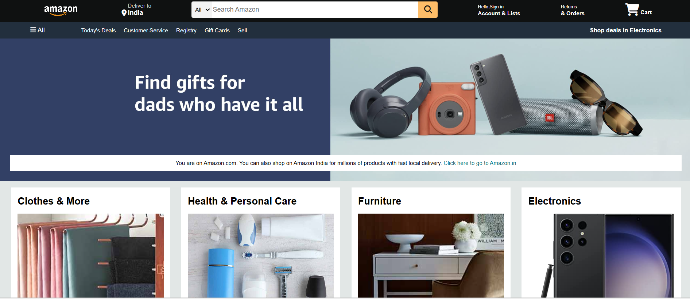

# 🛒 Amazon Clone

This is a simple front-end clone of the Amazon website, built using **HTML**, **CSS**. The project mimics the look and feel of the Amazon homepage and demonstrates responsive web design, layout structuring.

---

## 🔥 Features

- ✅ Responsive design
- ✅ Header with navigation bar
- ✅ Product cards with images, prices, and descriptions
- ✅ Banner section
- ✅ Footer similar to Amazon

---

## 🧰 Tech Stack

- HTML5
- CSS3
  
---
###  UI Screenshot

